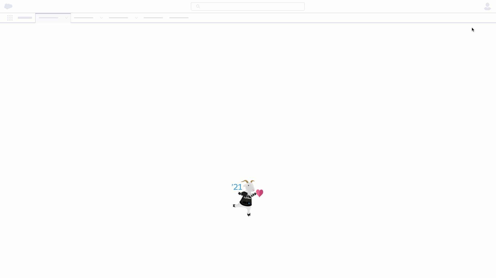

# Twilio SendGrid Salesforce Demo

Email is the backbone of your customer engagement. The Twilio SendGrid Email API gives you the flexibility to turn your ideas into reality, and the support to scale them into production.

## Prerequisite

You will need the following:

- [Twilio SendGrid Account](https://signup.sendgrid.com/)
- [Twilio SendGrid - API Key](https://docs.sendgrid.com/ui/account-and-settings/api-keys)

## Getting Started
### Install

- Package Id: 04t5e00000034mG
- [Production](https://login.salesforce.com/packaging/installPackage.apexp?p0=04t5e00000034mG)
- [Sandbox](https://test.salesforce.com/packaging/installPackage.apexp?p0=04t5e00000034mG)

### Twilio SendGrid Credentials

1. Go to Setup > Quick Find > Named Credentials.
2. Click on Twilio SendGrid.
3. Click Edit.
4. In the Password text field add your API Key.
5. Click Save.